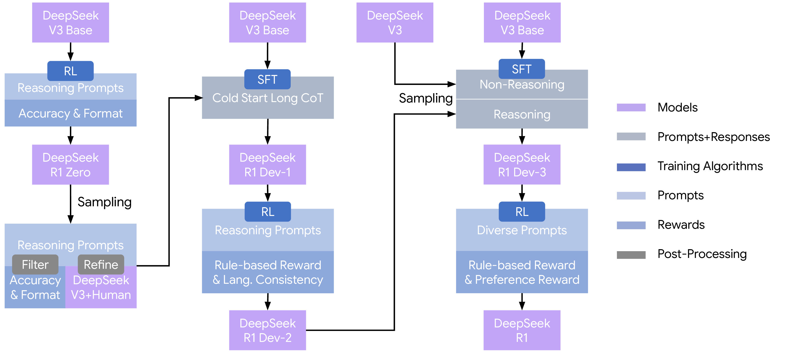
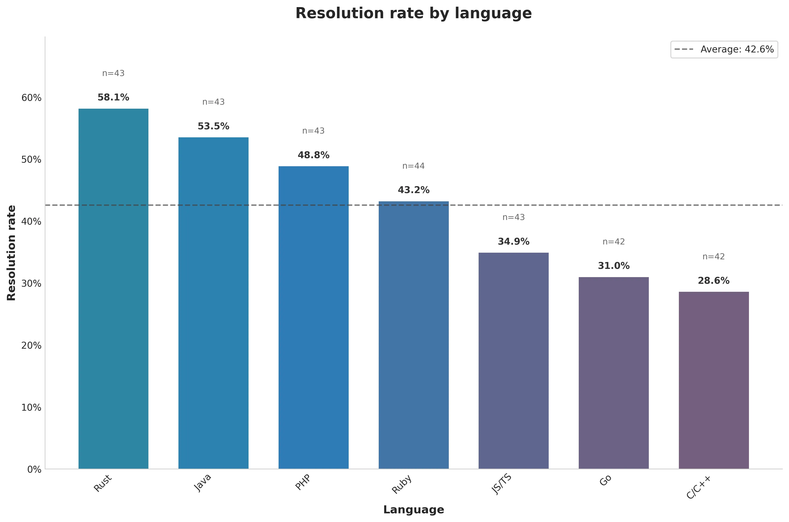
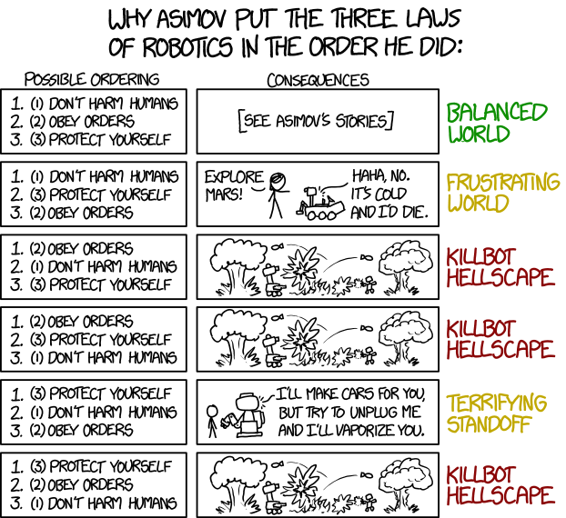

Before before we begin...
===

### Recommended setup

<!-- incremental_lists: true -->

- **(a)** Download a coding agent:
  **Claude Code** (`npm install -g @anthropic-ai/claude-code`)
  or **Codex** (`npm install -g @openai/codex`)

- **(b)** Download **Ghostty** (ghostty.org) terminal emulator —
  split your terminal into two panes:
  one for this slideshow, one for your coding agent

- **(c)** Have an IDE open on the side — we recommend **Zed**
  (zed.dev)

- **(d)** *Optional:* set up voice mode —
  macOS Dictation, Superwhisper, or your agent's
  built-in voice mode

<!-- incremental_lists: false -->

<!-- speaker_note: "Give the audience a minute to set up. The split terminal layout is important — they should be able to follow along and code at the same time." -->

<!-- end_slide -->

Before we begin...
===

<!-- jump_to_middle -->

Think of a **small project** you would like to build — something you find interesting but are not sure how to implement as software yet.

<!-- pause -->

It does not need to be polished or complete. A rough idea is enough.

<!-- pause -->

Later, when we get to prompt engineering, you will get to **build it live with a coding agent**.

<!-- end_slide -->

<!-- // ----- Part 0: Language Models ----- -->

<!-- jump_to_middle -->

<!-- alignment: center -->

# Language Models

<!-- end_slide -->

Self-Attention Mechanism
===

<!-- column_layout: [1, 1] -->

<!-- column: 0 -->

Given a sequence matrix **X** ∈ ℝ^(n × d_model) with *n* tokens:

**Q = X W_Q,   K = X W_K,   V = X W_V**

where W_Q, W_K ∈ ℝ^(d_model × d_k) and W_V ∈ ℝ^(d_model × d_v).

The attention score from token *i* to token *j*:

**α(i,j) = exp(q_i · k_j / √d_k) / Σ_l exp(q_i · k_l / √d_k)**

Matrix form:

**A = softmax(Q K^T / √d_k)**

**Z = A V**

Each output vector is a weighted mix of all value vectors:

**z_i = Σ_j α(i,j) v_j**

<!-- column: 1 -->

```
        ┌──────────┐
        │ Input X  │
        └──┬──┬──┬─┘
           │  │  │
         ┌─┴┐┌┴─┐┌┴──┐
         │Q ││K ││ V │
         └┬─┘└┬─┘└─┬─┘
          │   │    │
     ┌────┴───┴──┐ │
     │QK^T / √d_k│ │
     └─────┬─────┘ │
     ┌─────┴─────┐ │
     │  softmax  │ │
     └─────┬─────┘ │
           └───┬───┘
         ┌─────┴─────┐
         │  Z = A V  │
         └─────┬─────┘
         ┌─────┴─────┐
         │  Output z │
         └───────────┘
```

<!-- reset_layout -->

*Attention Is All You Need* (Vaswani et al., 2017)

<!-- speaker_note: "Walk through Q, K, V projections. The dot product measures how much each token should attend to every other token." -->

<!-- end_slide -->

Multi-Head Attention
===

<!-- column_layout: [1, 1] -->

<!-- column: 0 -->

Multi-head attention runs **H** attention blocks in parallel on different learned subspaces.

For each head *h = 1, 2, ..., H*:

**Q_h = X W_h^Q,   K_h = X W_h^K,   V_h = X W_h^V**

**O_h = softmax(Q_h K_h^T / √d_k) V_h**

with *d_k = d_v = d_model / H*.

Concatenate all heads:

**M = Concat(O_1, O_2, ..., O_H)**

Final output projection:

**Y = M W^O**

<!-- column: 1 -->

```
      ┌────────────────────┐
      │      Input X       │
      └─────────┬──────────┘
      ┌─────────┴──────────┐
      │  Per-head Q, K, V  │
      └──┬───────┬───────┬─┘
         │       │       │
       ┌─┴──┐  ┌─┴──┐  ┌─┴──┐
       │O_1 │  │O_2 │  │O_H │
       └──┬─┘  └──┬─┘  └──┬─┘
          └───┬───┴───────┘
      ┌───────┴────────────┐
      │  Concat(O_1..O_H)  │
      └─────────┬──────────┘
        ┌───────┴───────┐
        │   Y = MW^O    │
        └───────┬───────┘
        ┌───────┴───────┐
        │   Output Y    │
        └───────────────┘
```

<!-- reset_layout -->

*Attention Is All You Need* (Vaswani et al., 2017)

<!-- speaker_note: "Each head learns to attend to different aspects — position, syntax, semantics. The concat + projection merges them." -->

<!-- end_slide -->

Transformer
===

<!-- column_layout: [1, 1] -->

<!-- column: 0 -->

A Transformer layer combines multi-head attention, feed-forward networks, and residual connections. This is the **pre-norm** variant (used in GPT-2+), where LayerNorm precedes each sub-layer.

For layer *l*, let input be *X_l*:

**N_l = LN(X_l)**

**M_l = MHA(N_l)**

**H_l = X_l + M_l**

**R_l = LN(H_l)**

**F_l = FFN(R_l)**

**X_(l+1) = H_l + F_l**

<!-- column: 1 -->

```
    ┌─────────────┐
    │  Input X_l  │
    └──────┬──────┘
       ┌───┘───────────┐
       │               │
    ┌──┴──────────┐    │
    │  LayerNorm  │    │
    └──────┬──────┘    │
    ┌──────┴──────┐    │
    │     MHA     │    │
    └──────┬──────┘    │
    ┌──────┴──────┐    │
    │  Add      ◁─┼────┘
    └──────┬──────┘
       ┌───┘───────────┐
       │               │
    ┌──┴──────────┐    │
    │  LayerNorm  │    │
    └──────┬──────┘    │
    ┌──────┴──────┐    │
    │     FFN     │    │
    └──────┬──────┘    │
    ┌──────┴──────┐    │
    │  Add      ◁─┼────┘
    └──────┬──────┘
    ┌──────┴──────┐
    │Output X_l+1 │
    └─────────────┘
```

<!-- reset_layout -->

*Attention Is All You Need* (Vaswani et al., 2017)

<!-- speaker_note: "This is pre-norm (LN before sublayer), not the original 2017 post-norm. Modern GPT-style models all use pre-norm because it trains more stably." -->

<!-- end_slide -->

Language Models
===

**Autoregressive generation: predict the next token, append, repeat.**

```
Context        ┌───────────┐   ┌───────────┐   ┌─────────────────┐
x_1,...,x_t ──▶│ Tokenizer │──▶│ Embedding │──▶│ Transformer x N │──┐
               └───────────┘   └───────────┘   └─────────────────┘  │
                                                                     │
  ┌──────────────────────────────────────────────────────────────────┘
  │
  │  ┌─────────┐   ┌──────────────────┐   ┌──────────┐   ┌───────────┐
  └─▶│ LM Head │──▶│ softmax(logits/τ)│──▶│ Sample / │──▶│ Next token│
     └─────────┘   └──────────────────┘   │ Argmax   │   │  x_(t+1)  │
                          ▲               └──────────┘   └─────┬─────┘
                          │                    ▲               │
                     temperature τ          top-p              │
                                                               │
                        ◁──── append to context, repeat ───────┘
```

<!-- pause -->

The model sees **only** its context window. Everything it "knows" must be in the prompt or in its weights.

*Language Models are Few-Shot Learners* (Brown et al., 2020)

<!-- speaker_note: "Emphasize - the model has no persistent memory. Each forward pass is stateless, context is everything." -->

<!-- end_slide -->

Context Window
===

```
Long prompt   ┌──────────┐   Active context    ┌──────────────┐   ┌────────────┐
  history ───▶│  Window  │──▶ (latest tokens)─▶│  Transformer │──▶│ Next token │
              │ Selector │                      │ forward pass │   └─────┬──────┘
              └──────────┘                      └──────────────┘         │
                   ▲                                                     │
                   │         ┌─────────────────┐                         │
                   └─────────│ Context manager │◁────────────────────────┘
                             │ and append      │
                             └────────┬────────┘
                                      │
                             ┌────────┴────────┐
                             │ Dropped oldest  │
                             │ tokens (lost!)  │
                             └─────────────────┘
```

<!-- pause -->

**Intuition: the model has a fixed maximum sequence length; the application decides what fits.**

- The model's context window is a hard upper bound on input tokens
- The **application / harness** manages what goes in (truncation, summarization, RAG)
- There is no built-in "sliding window" — context management is an engineering problem
- Tokens that don't fit are never seen by the model

*Lost in the Middle: How Language Models Use Long Contexts* (Liu et al., 2023)

<!-- speaker_note: "The model itself has no sliding window — it just has a max sequence length. The harness (your application) is responsible for deciding what goes in. This is why harness engineering matters." -->

<!-- end_slide -->

Chain-of-Thought
===

**Intuition: solve hard questions with intermediate steps, not one direct jump.**

```
Question ──▶ Prompt + ──▶ Reasoning steps ──▶ Final answer
             context      (chain of thought)
```

<!-- pause -->

- Prompt the model to show its work ("think step by step")
- Each reasoning step is generated as tokens in the context
- The model conditions on its own prior steps to reach the answer

<!-- pause -->

Self-verification (checking and revising answers) is a separate technique that builds on CoT but was introduced later.

*Chain-of-Thought Prompting Elicits Reasoning in LLMs* (Wei et al., 2022)

<!-- speaker_note: "CoT is one of the most important practical techniques. It works because it gives the model intermediate scratch space in the context window." -->

<!-- end_slide -->

CoT: History
===

**Intuition: CoT began as prompting, then expanded into a broader reasoning stack.**

```
2022: CoT ──▶ Self- ──▶ ReAct / ──▶ Search + ──▶ Reasoning-first
prompting     consistency  tool use    planning     training
                                                       │
Only prompt                                            ▼
engineering? ─────────────────────▶ Now: prompt + decoding + training
```

<!-- pause -->

Today, CoT is more than prompt engineering:

- Early stage: "think step by step" prompting
- Next: better decoding and agentic inference
- Later: reasoning-focused training (GRPO, RL)

*Self-Consistency* (Wang et al., 2022) · *ReAct* (Yao et al., 2022)

<!-- speaker_note: "The key insight is that reasoning went from a prompt trick to a training objective." -->

<!-- end_slide -->

CoT: Optimization Intuition
===

**Analogy: CoT resembles iterative refinement — small steps toward a solution.**

```
Question ──▶ State 0 ──▶ small ──▶ State 1 ──▶ more local ──▶ State T ──▶ Final
                          update               updates                     answer
     │                                                                       ▲
     │                                                                       │
     └────────────── one-shot jump (hard!) ──────────────────────────────────┘
```

<!-- pause -->

- Each reasoning step is a small refinement of the solution state
- The sequence of steps forms a trajectory toward the answer
- A single direct jump to the answer is usually harder

<!-- pause -->

This is an analogy, not a formal equivalence — but the intuition holds: decomposition makes hard problems tractable.

*Chain-of-Thought Prompting Elicits Reasoning in LLMs* (Wei et al., 2022)

<!-- speaker_note: "This is a useful analogy, not a formal claim. CoT is not literally gradient descent — but the intuition that incremental steps beat large jumps transfers well." -->

<!-- end_slide -->

GRPO (DeepSeek-R1 and OpenAI o1)
===

<!-- column_layout: [1, 1] -->

<!-- column: 0 -->

**Intuition: step-by-step reasoning should be learned by the model, not only triggered by prompts.**

GRPO adds an RL stage to encourage this behavior directly.

- Sample a group of candidate responses for the same prompt
- Score each, then normalize rewards relative to the group mean
- Update the policy: upweight above-average, downweight below-average

Goal: make reasoning/search a native behavior of the model.

<!-- column: 1 -->



<!-- reset_layout -->

*DeepSeek-R1* (DeepSeek-AI et al., 2025)

<!-- speaker_note: "GRPO = Group Relative Policy Optimization. Simpler than PPO — no critic network, just relative ranking within a group." -->

<!-- end_slide -->

GRPO: The AHA Moment
===

<!-- column_layout: [1, 1] -->

<!-- column: 0 -->

**Intuition: with enough RL, reasoning behavior can emerge as a capability, not just a prompt pattern.**

- An "AHA moment" appears during training: behavior shifts from shallow answers to structured reasoning
- The model starts showing self-reflection and correction more naturally
- Strong gains on reasoning-heavy tasks (math, coding)
- Reasoning quality becomes less dependent on manually crafted CoT prompts

Message: GRPO makes reasoning a learned default behavior.

<!-- column: 1 -->

**Table 2 | An interesting "aha moment" of DeepSeek-R1-Zero.**

**Question:** If a > 1, then the sum of the real solutions of
sqrt(a - sqrt(a + x)) = x is equal to

**Response:** `<think>`
To solve sqrt(a - sqrt(a + x)) = x, let's start by
squaring both sides...
(sqrt(a - sqrt(a + x)))² = x² => a - sqrt(a + x) = x².
Rearrange to isolate the inner square root term:
(a - x²)² = a + x => x⁴ - 2ax² - x + (a² - a) = 0
...
<span style="color: red">Wait, wait. Wait. That's an aha moment I can flag here.</span>
Let's reevaluate this step-by-step...
We started with the equation:
sqrt(a - sqrt(a + x)) = x
First, let's square both sides:
a - sqrt(a + x) = x² => sqrt(a + x) = a - x²
...

<!-- reset_layout -->

*DeepSeek-R1* (DeepSeek-AI et al., 2025)

<!-- speaker_note: "The wait-wait moment in the training output is striking — the model learns to pause, reconsider, and self-correct without being prompted to." -->

<!-- end_slide -->

Limitation: Transformer Scaling
===

<!-- column_layout: [1, 1] -->

<!-- column: 0 -->

**Intuition: transformer reasoning quality scales, but attention cost scales too.**

- Self-attention becomes expensive as sequence length grows
- Longer contexts increase latency and memory pressure
- Practical systems must trade off quality, speed, and cost

Result: long-context reasoning can become bottlenecked by compute.

<!-- column: 1 -->

```
    ┌─────────────┐
    │  Input X_l  │
    └──────┬──────┘
    ┌──────┴──────┐
    │  LayerNorm  │
    └──────┬──────┘
    ┌──────┴──────┐
    │     MHA     │◁── Attention cost
    └──────┬──────┘    grows with length!
    ┌──────┴──────┐
    │     Add     │
    └──────┬──────┘
    ┌──────┴──────┐
    │     FFN     │
    └──────┬──────┘
    ┌──────┴──────┐    Memory/latency
    │     Add     │◁── bottleneck
    └──────┬──────┘
    ┌──────┴──────┐
    │Output X_l+1 │
    └─────────────┘
```

<!-- reset_layout -->

*Attention Is All You Need* (Vaswani et al., 2017)

<!-- speaker_note: "O(n²) attention is the core bottleneck. Flash attention and sparse attention help but don't eliminate the fundamental scaling issue." -->

<!-- end_slide -->

Limitation: Context Window Failures
===

**Intuition: fixed context windows can drop old constraints and trigger catastrophic forgetting.**

- Only recent tokens remain in the active window
- Older instructions/facts can fall outside the window
- Model may forget them within the same long session
- Performance drops when evidence is deep in the second half of a long context (middle-position weakness)

<!-- pause -->

Result: drift, contradiction, and long-context failures.

<!-- pause -->

This is why **harness engineering** matters — external memory, chunked processing, and verification loops compensate for the model's finite attention span.

*Lost in the Middle* (Liu et al., 2023)

<!-- speaker_note: "This connects directly to the prompt engineering anti-patterns we will see later — drifting and over-obedience both stem from context window limitations." -->

<!-- end_slide -->

Limitation: Overconfidence
===

<!-- column_layout: [1, 1] -->

<!-- column: 0 -->

**Intuition: confidence and correctness can diverge.**

- Model probability is not the same as factual truth
- LMs can sound certain while being wrong
- Miscalibration becomes worse on harder or out-of-domain inputs

Hallucination is often a composition of multiple issues:
overconfidence + missing evidence + context/retrieval errors.

<!-- column: 1 -->

```
    ┌────────────┐
    │  Question  │
    └─────┬──────┘
    ┌─────┴──────┐
    │   Model    │
    │   answer   │
    └──┬──────┬──┘
       │      │
   ┌───┴────┐┌┴──────────┐
   │  High  ││  Actual   │
   │confid. ││correctness│
   └───┬────┘└────┬──────┘
       └────┬─────┘
    ┌───────┴──────┐
    │  Calibration │
    │     gap      │
    └───────┬──────┘
    ┌───────┴──────┐
    │   Confident  │
    │hallucination │
    └──────────────┘
```

<!-- reset_layout -->

*Language Models (Mostly) Know What They Know* (Kadavath et al., 2022)

<!-- speaker_note: "This is why verification and formalism matter. You cannot trust confidence alone." -->

<!-- end_slide -->

Limitation: Test-Passing != Good Engineering
===

**Intuition: RL for code optimizes what is easy to verify.**

<!-- incremental_lists: true -->

- **Reward misspecification:** pass-at-k and unit tests are proxies, not the full objective
- **Proxy gaming:** patches can pass tests but still diverge from intended behavior
- **Quality blind spots:** security, maintainability, and readability can regress while tests still pass
- **Optimization bias:** GRPO-style objectives can bias response length without better normalization
- **Current direction:** combine richer rewards (tests + analysis + better judges)

<!-- pause -->

No single loss fully captures "good engineering."

<!-- speaker_note: "This is the fundamental tension. Tests are necessary but not sufficient. Human review and formal tools fill the gap." -->

<!-- end_slide -->

<!-- // ----- Part 1: Coding Agents ----- -->

<!-- jump_to_middle -->

<!-- alignment: center -->

# Vibe Coding and Coding Agents

<!-- end_slide -->

What is a Coding Agent?
===

**Intuition: a coding agent is an execution loop that turns intent into validated code changes.**

<!-- column_layout: [1, 1] -->

<!-- column: 0 -->

What it does:

<!-- incremental_lists: true -->

- reads repo context and constraints,
- plans and applies code edits,
- runs tests, linters, and checks,
- reports diffs, risks, and next actions.

<!-- column: 1 -->

Human role:

<!-- incremental_lists: true -->

- set goals and acceptance criteria,
- review outputs,
- steer the next iteration.

<!-- reset_layout -->

<!-- speaker_note: "Distinguish from copilot-style completion. An agent plans, iterates, debugs — not just autocomplete." -->

<!-- end_slide -->

The Ralph Loop
===

The simplest coding agent is a bash loop:

```bash
while :; do cat PROMPT.md | claude-code ; done
```

<!-- pause -->

Source: "Ralph Wiggum as a software engineer" (Huntley, 2025)

<!-- speaker_note: "This is vibe coding in its purest form. The loop runs the agent repeatedly with a fixed prompt." -->

<!-- end_slide -->

Coding Agent Flow
===

```
┌───────────────────┐
│ Goal/Constraints  │
├───────────────────┤
│ Context Read      │ ──→ files, git, docs
├───────────────────┤
│ Plan + Edits      │ ──→ write code
├───────────────────┤
│ Run Checks        │ ──→ tests, lints, types
├───────────────────┤
│ Diff + Summary    │ ──→ report changes
├───────────────────┤
│ Human Review      │
├───────────────────┤
│ Approve/Revise    │ ──→ iterate ↑
└───────────────────┘
```

<!-- speaker_note: "Walk through each step. The feedback loop from approve/revise back to plan+edits is what makes it an agent, not a one-shot tool." -->

<!-- end_slide -->

Tooling and Language Choices
===

**Intuition: instruction following is strong; engineering discipline is now the bottleneck.**

<!-- column_layout: [1, 1] -->

<!-- column: 0 -->

<!-- incremental_lists: true -->

- Agents follow instructions well; human review remains the quality gate
- Prefer languages that surface bugs early (types, linters, strict compilers)
- Make correctness explicit and violations loud
- TDD and spec-first development matter more with agents
- Encode best practices in `AGENTS.md` / skills for auditability

<!-- column: 1 -->



SWE-bench Multilingual: Rust has the highest resolution rate.

<!-- reset_layout -->

<!-- speaker_note: "The compiler is doing heavy lifting — the agent gets fast feedback from rustc, clippy, etc." -->

<!-- end_slide -->

<!-- // ----- Part 2: Prompt Engineering ----- -->

<!-- jump_to_middle -->

<!-- alignment: center -->

# Prompt Engineering

<!-- end_slide -->

Precision Language
===

<!-- column_layout: [3, 2] -->

<!-- column: 0 -->

> "In this simulated reality, English serves as the underlying
> programming language, where the environment responds only to
> statements of absolute logical rigor and zero ambiguity."

<!-- pause -->

> "The protagonist discovers that surviving the system requires
> 'precise speaking' -- the art of using flawlessly exact language
> to compel the simulation's infrastructure to manifest one's intent."

<!-- pause -->

— *The Cookie Monster* (Vernor Vinge, 2003)

<!-- column: 1 -->


<!-- reset_layout -->

<!-- speaker_note: "Frame prompt engineering as a discipline of precision, not just writing nice sentences." -->

<!-- end_slide -->

Giving the Model Context
===

<!-- column_layout: [1, 1] -->

<!-- column: 0 -->

### Eagerly loaded (before the task starts)

- `CLAUDE.md` / `AGENTS.md` / `.cursorrules` — always-on project policy
- Custom system prompts — API-level or tool-level instructions
- README / docs / specs — project documentation
- Pinned / attached files — type definitions, configs, schemas
- Git state — branch, recent commits, diffs
- MCP servers — expose structured data sources at session start

<!-- column: 1 -->

### Lazily retrieved (during execution)

- RAG / embeddings search — pull relevant snippets on demand
- Agent tool use — read files, grep, glob as needed
- MCP tool calls — query databases, APIs, tickets mid-task
- Compiler / linter output — error messages as feedback
- Test results — pass/fail signals that steer next steps
- Web search / fetch — external docs, issues, references

<!-- reset_layout -->

<!-- speaker_note: "The key insight is eager vs lazy. Over-loading the context wastes tokens, under-loading means the agent flies blind." -->

<!-- end_slide -->

Saving Tokens
===

<!-- column_layout: [1, 1] -->

<!-- column: 0 -->

### Reduce what enters the context

- Serialize repeated logic into a CLI tool — reuse as a tool call
- Write skills for reusable prompt procedures
- Split big tasks into bounded sub-tasks
- Lazy retrieval over pre-loading — let the agent read on demand
- Persist state to files (`plan.md`, checklists) and re-load

<!-- column: 1 -->

### Compress what stays in the context

- Summarize state periodically — short summaries over raw logs
- Use compact formats — markdown tables, YAML over verbose prose
- Request diffs, not full files
- Prune irrelevant context — drop old messages, resolved threads
- Reference file paths instead of inlining full contents

<!-- reset_layout -->

<!-- speaker_note: "Token economy is real. Every wasted token is attention the model cannot spend on your actual problem." -->

<!-- end_slide -->

Anti-Pattern: Over-Obedience Trap
===

<!-- column_layout: [3, 2] -->

<!-- column: 0 -->

### Bad: rigid instruction with wrong assumption

> "Add OpenMP parallelization to the `diagonalize` function in
> `src/hamiltonian.jl`. Use 8 threads and split the k-point loop."

Problem: you haven't checked if diagonalization is even the
bottleneck, if LAPACK is already threaded, or if the code uses
MPI elsewhere. The model will obey and build the wrong thing.

### Good: flexible instruction that invites exploration

> "The band structure calculation is slow for large unit cells.
> Explore the codebase to find where time is spent and what
> parallelism already exists. Propose optimization options
> before making changes."

<!-- pause -->

**Rule of thumb:** constrain the *goal*, not the *method*.

<!-- column: 1 -->



xkcd #1613 (Randall Munroe, 2015)

<!-- reset_layout -->

<!-- speaker_note: "Over-specification is the most common failure mode for experienced engineers new to agents." -->

<!-- end_slide -->

Anti-Pattern: Drifting
===

<!-- column_layout: [1, 1] -->

<!-- column: 0 -->

### Bad: one giant task with no checkpoints

> "Refactor the entire DMRG module to support finite-temperature
> density matrices. Update the tensor network contraction, add
> purification, and fix all the tests."

Problem: the agent runs for many steps, accumulates wrong
assumptions, silently drifts, and delivers a large diff
you can't easily review.

<!-- column: 1 -->

### Good: incremental plan with human checkpoints

> "I want to add finite-temperature support to the DMRG module.
> Start by reading the current structure and propose a step-by-step
> plan. Ask me before each major change."

<!-- reset_layout -->

<!-- pause -->

**Rule of thumb:** big tasks drift. Break them into
plan → checkpoint → execute cycles. Keep the human in the loop.

<!-- speaker_note: "The longer the agent runs unsupervised, the more likely it drifts. Short feedback loops are cheap insurance." -->

<!-- end_slide -->

Anti-Pattern: No Verification
===

<!-- column_layout: [1, 1] -->

<!-- column: 0 -->

### Bad: no way to verify correctness

> "Implement the Hubbard model exact diagonalization for a
> 4×4 lattice with periodic boundary conditions."

Problem: the agent writes plausible code but you have no
automated check. You read every line manually, or trust blindly.

<!-- column: 1 -->

### Good: explicit verification criteria

> "Implement Hubbard model ED for a 4×4 lattice with PBC.
> Verify against the known half-filling ground state energy.
> Add a test that compares with the 2×2 analytical result.
> Run tests until they pass."

<!-- reset_layout -->

<!-- pause -->

**Rule of thumb:** always give the agent a way to check its own
work. Tests, known results, and assertions turn hope into
a feedback loop.

<!-- speaker_note: "Without verification, you are just hoping the code is correct. With it, the agent can self-correct." -->

<!-- end_slide -->

The Evolution of AI-Assisted Engineering
===

```
2021         2022          2023       2024          2025          2026
  │            │             │          │             │             │
  ▼            ▼             ▼          ▼             ▼             ▼
Copilot     ChatGPT       GPT-4     o1/Claude 3.5  Claude 4     Claude 4.5
preview     (Nov)         (Mar)     Gemini/MCP     o3/Gemini 2.5 Gemini 3
  │            │             │          │             │             │
  ▼            ▼             ▼          ▼             ▼             ▼
AI-assisted  Prompt       Agentic   Reasoning     Vibe          Harness
completion   engineering  prototypes models       coding        engineering
```

<!-- pause -->

Each stage was enabled by a step change in model capability — and each exposed the limits of the previous workflow.

<!-- speaker_note: "The model milestones are approximate. The point is that each capability jump changed the bottleneck, and the engineering practice evolved to match." -->

<!-- end_slide -->

From Completion to Orchestration
===

<!-- column_layout: [1, 1] -->

<!-- column: 0 -->

### 2021–2023: AI-assisted completion

- **Copilot** (2021): autocomplete on steroids — suggests the next few lines
- **ChatGPT** (2022): conversational code generation from descriptions
- **GPT-4** (2023): first models capable enough for multi-file edits

Human role: **author with autocomplete**. You still write the code; the AI fills in boilerplate.

**Bottleneck:** model capability. Models couldn't hold enough context or plan across files.

<!-- column: 1 -->

### 2024: Prompt engineering era

- **GPT-4o** (May): fast multimodal model
- **Claude 3.5 Sonnet** (Jun): long context, tool use, reliable instruction following
- **o1** (Sep): first reasoning model — plans multi-step, self-evaluates
- **MCP** (Nov): standard protocol for connecting agents to tools

Human role: **prompt engineer**. Craft precise instructions, manage context, design verification.

**Bottleneck:** prompt quality. Models were capable but sensitive to how you asked. The techniques in this lecture — context management, anti-patterns, verification — come from this era.

<!-- reset_layout -->

<!-- speaker_note: "Prompt engineering was the right focus when models were capable but fragile. Getting the prompt right was the difference between success and failure." -->

<!-- end_slide -->

From Vibe Coding to Harness Engineering
===

<!-- column_layout: [1, 1] -->

<!-- column: 0 -->

### 2025: Vibe coding

> "There's a new kind of coding I call 'vibe coding', where you fully give in to the vibes, embrace exponentials, and forget that the code even exists."
>
> — Andrej Karpathy (Feb 2025)

**o3** (Apr), **Claude 4** (May), **Gemini 2.5** (Jun) — models got good enough that you could describe what you want and get working code. Cursor, Windsurf, Claude Code — the tools matured.

**Bottleneck:** production quality. Vibe-coded software had security gaps, no error handling, unmaintainable architecture. It worked for prototypes but not for shipping.

<!-- column: 1 -->

### 2026: Agentic / harness engineering

> "You are not writing the code directly 99% of the time. You are orchestrating agents who do, and acting as oversight."
>
> — Andrej Karpathy (Feb 2026)

**Claude 4.5/4.6**, **Gemini 3**, **Codex** (OpenAI's coding agent, now at codex-5.4) — models and agents mature together.

Human role: **architect and supervisor**. Design the environment, define constraints, build feedback loops.

**Bottleneck:** the harness. Models are strong; the constraint is how well you structure the environment around them.

<!-- pause -->

### The pattern

| Era | Focus | Human role |
|-----|-------|------------|
| Completion | Model capability | Author |
| Prompt eng. | Prompt quality | Prompt engineer |
| Vibe coding | Speed to prototype | Describer |
| Harness eng. | Production reliability | Architect |

<!-- reset_layout -->

<!-- speaker_note: "Each era didn't replace the previous one — it absorbed it. You still need prompt engineering skills in the harness era. But the bottleneck moved from 'can the model do it' to 'can you build the right environment for it'." -->

<!-- end_slide -->

Harness Engineering
===

**The engineer's job shifts from writing code to designing the environment in which agents write code.**

<!-- column_layout: [1, 1] -->

<!-- column: 0 -->

### What is a harness?

The full environment of scaffolding, constraints, and feedback loops that surround an agent and let it do stable work:

- Repository structure and conventions
- CI configuration and test suites
- Linters, formatters, type checkers
- Project instructions (`AGENTS.md`)
- Application frameworks and package managers
- External tool integrations (MCP, etc.)

<!-- column: 1 -->

### OpenAI's experiment (Aug 2025 – Jan 2026)

A small team (3→7 engineers) built a beta product:

- **~1M lines** of production code
- **0 lines** manually written
- **~1,500 PRs** merged
- **3.5 PRs/engineer/day**
- **~10× faster** than manual development

The agents wrote application logic, docs, CI config, observability, and tooling — everything.

<!-- reset_layout -->

<!-- pause -->

> Your primary job is no longer to write code, but to **design environments**, **specify intent**, and **build feedback loops** that allow agents to do reliable work.

<!-- speaker_note: "This is the OpenAI blog post that coined the term. The key insight: the harness is the product, not the code. Everything we covered — anti-patterns, verification, formalism — is harness engineering." -->

<!-- end_slide -->

Harness Engineering: Five Principles
===

<!-- incremental_lists: true -->

**1. What the agent can't see doesn't exist.**
Push all decisions into the repo as markdown, schemas, and exec plans. An ExecPlan is a self-contained design doc — written so that a beginner could read it and implement the feature end to end.

**2. Ask what capability is missing, not why the agent is failing.**
Don't prompt harder — instrument the environment better. Build custom tools with observability rather than relying on libraries the agent may struggle with.

**3. Mechanical enforcement over documentation.**
Enforce rules through code, not prose. Custom linters and structural tests fail the build immediately on violation. The linters themselves were written by Codex.

**4. Give the agent eyes.**
Connect DevTools, telemetry, and runtime snapshots. Pre/post-task comparison plus runtime event observation lets the agent apply fixes in a loop until everything is clean.

**5. A map, not a manual.**
Provide a brief architectural overview showing structure and boundaries — not an encyclopedia. Architectural invariants are often expressed as "something does not exist here."

<!-- speaker_note: "These five principles are directly from the OpenAI blog. Notice how they mirror our anti-patterns: no verification maps to principle 4, drifting maps to principle 5, over-obedience maps to principle 2." -->

<!-- end_slide -->

Harness Engineering: Architecture
===

<!-- column_layout: [1, 1] -->

<!-- column: 0 -->

### Enforced dependency layers

Each layer can only reference layers above it. Linter errors inject correction instructions into the agent's context for self-repair.

```
  Types          (pure data)
    │
  Config         (settings)
    │
  Repo           (data access)
    │
  Service        (business logic)
    │
  Runtime        (orchestration)
    │
  UI             (presentation)
```

Violations are caught at build time, not code review.

<!-- column: 1 -->

### Documentation as architecture

```
docs/
├── design-docs/
│   ├── index.md
│   └── core-beliefs.md
├── exec-plans/
│   └── feature-x.md
├── product-specs/
└── references/
    └── design-system.txt
```

<!-- pause -->

- Root `AGENTS.md` is a **map**, not a manual — it points agents to the right doc for their task
- Agents read only docs relevant to their working directory — preserves context window
- Cross-links are mechanically validated by CI

<!-- pause -->

### Entropy management

Background agents continuously scan for drift and open refactoring PRs — automated garbage collection for code entropy.

<!-- reset_layout -->

<!-- speaker_note: "The layered architecture is enforced by linters the agents wrote themselves. The entropy management is key — without it, agent-generated code accumulates technical debt faster than humans can review." -->

<!-- end_slide -->

Simplify and Formalize
===

**Good formalism is your weapon against hallucination.**

When coding with agents:

<!-- incremental_lists: true -->

- Keep asking the model to simplify the code it generates
- Take abstractions seriously — name things precisely, enforce invariants with types
- Prefer strict, verifiable structure over clever but opaque logic
- Formal tools (type checkers, linters, proof assistants) catch errors that natural language reviews miss

<!-- pause -->

> "With proof assistants, you don't need to trust the people
> you're working with, because the program gives you this
> 100 percent guarantee."
>
> — Terence Tao

<!-- pause -->

The more rigorous your formalism, the less room for
hallucination to hide.

<!-- speaker_note: "This is the bridge between prompt engineering and harness engineering. Formal tools close the loop." -->

<!-- end_slide -->

The Tool Surface
===

**Intuition: tools are how agents interact with the world beyond text generation.**

<!-- column_layout: [1, 1] -->

<!-- column: 0 -->

### Reading and searching

- **Read** — read files by path
- **Grep** — search file contents by regex
- **Glob** — find files by pattern
- **LSP** — type checking, go-to-definition
- **WebFetch / WebSearch** — external docs

### Writing and executing

- **Edit / Write** — modify or create files
- **Bash** — run shell commands, builds, tests
- **Git** — commits, diffs, branches

<!-- column: 1 -->

### Coordination

- **AskUserQuestion** — ask the human for clarification mid-task
- **Agent** — spawn sub-agents for parallel work
- **TodoWrite** — track progress on multi-step tasks

<!-- pause -->

### Why AskUserQuestion matters

The agent does not have to guess. When uncertain about intent, scope, or a design choice, it can **stop and ask**.

This is the cheapest way to prevent drift — a single clarifying question costs far less than a wrong implementation.

<!-- reset_layout -->

<!-- speaker_note: "Tools turn a language model into an agent. Without tools it can only generate text. With tools it can read, write, execute, and coordinate." -->

<!-- end_slide -->

Skills
===

**Skills are reusable prompt modules that teach the agent a domain or workflow.**

<!-- column_layout: [1, 1] -->

<!-- column: 0 -->

### What is a skill?

- A markdown file (`SKILL.md`) with optional scripts and references
- Encodes domain knowledge, conventions, and procedures
- The agent can **pick up skills automatically** based on the task — you don't always need to invoke them explicitly
- You can also invoke a skill directly with `/skill-name`

### Structure and management

```
my-skill/
├── SKILL.md          # instructions
├── references/       # docs, specs
└── scripts/          # helper tools
```

```bash
# manage skills with ion:
ion skill init my-skill
ion skill link my-skill
```

<!-- column: 1 -->

### Claude Code

```
$ claude

> /presenterm add a new slide about MCP

  Using skill: presenterm
  Reading SKILL.md...
  I'll add a new slide using the presenterm
  format with <!-- end_slide --> separator
  and setext headers...
```

### Codex (OpenAI)

```
$ codex

> $presenterm add a new slide about MCP

  Using skill: presenterm
  Adding slide with <!-- end_slide -->
  separator and setext headers...
```

Explicit invocation: `/skill-name` (Claude Code) or `$skill-name` (Codex). But well-written skill descriptions mean the agent often picks them up automatically — no explicit invocation needed.

<!-- reset_layout -->

<!-- speaker_note: "The key idea: skills are not just slash commands. A well-described skill gets picked up automatically when the agent sees a matching task. The slash command is a fallback for when you want to force it." -->

<!-- end_slide -->

Model Context Protocol (MCP)
===

**Intuition: MCP is a standard interface that lets agents connect to external data and services.**

<!-- column_layout: [1, 1] -->

<!-- column: 0 -->

### What it is

- An open protocol for tool and data integration
- Agent connects to **MCP servers** that expose tools and resources
- Servers can wrap anything — databases, APIs, SaaS tools, local services

### How it works

```
Agent ──▶ MCP Client ──▶ MCP Server ──▶ Service
                              │
                         tools + resources
                         exposed as schema
```

<!-- column: 1 -->

### Why it matters

<!-- incremental_lists: true -->

- **Composability** — plug in new capabilities without changing the agent
- **Standardization** — one protocol instead of bespoke integrations per tool
- **Separation of concerns** — the agent reasons, the server connects
- **Context injection** — servers can provide resources the agent reads on demand

<!-- pause -->

### Examples

- GitHub MCP — PRs, issues, code search
- Database MCP — query SQL/NoSQL directly
- Slack MCP — read channels, send messages
- Custom MCP — wrap any internal API

<!-- reset_layout -->

<!-- speaker_note: "MCP decouples the agent from specific integrations. Think of it like USB for AI tools — a universal plug." -->

<!-- end_slide -->

<!-- // ----- Case Study: Kirin Rust Refactor ----- -->

Case Study: Kirin Rust Refactor
===

<!-- column_layout: [1, 1] -->

<!-- column: 0 -->

### What is Kirin?

**K**ernel **I**ntermediate **R**epresentation **IN**frastructure — an MLIR-inspired compiler IR framework originally written in Python.

The `rust` branch is a full rewrite, built almost entirely by coding agents.

### By the numbers

| Metric | Value |
|--------|-------|
| Crates | 21 |
| Rust source files | ~290 |
| Agent skills | 23 |
| RFCs (design docs) | 14 |
| Derive macros | 5 crates |

<!-- column: 1 -->

### Harness principles in action

**What the agent can't see doesn't exist** — 14 RFCs and a structured `AGENTS.md` give agents full architectural context.

**Mechanical enforcement** — `cargo nextest`, `cargo fmt`, `insta` snapshot tests, and custom `xtask` validators catch regressions at build time.

**A map, not a manual** — `AGENTS.md` lists crate purposes, build commands, and conventions concisely. Domain-specific skills (derive macros, RFC writing) encode deep knowledge.

**Ask what capability is missing** — 23 skills cover everything from RFC authoring to code review to systematic debugging. When agents struggled, the response was a new skill — not a longer prompt.

<!-- reset_layout -->

github.com/QuEraComputing/kirin (branch: `rust`)

<!-- speaker_note: "This is a real-world example of harness engineering at scale. The key takeaway: the harness (skills, RFCs, AGENTS.md, strict compiler) is what makes agent-driven development feasible for a complex compiler infrastructure project." -->

<!-- end_slide -->

<!-- // ----- Part 3: Live Demo — Stabilizer Tableau Simulator ----- -->

<!-- jump_to_middle -->

<!-- alignment: center -->

# Live Demo: Stabilizer Tableau Simulator

Aaronson & Gottesman (2004)

<!-- end_slide -->

Stabilizer Tableau Simulator
===

<!-- column_layout: [1, 1] -->

<!-- column: 0 -->

### The stabilizer formalism

A stabilizer state |ψ⟩ on *n* qubits is uniquely defined by *n* independent Pauli operators *S_i* such that:

**S_i |ψ⟩ = |ψ⟩** for all *i*

Example: |0⟩ is stabilized by **+Z**. |+⟩ is stabilized by **+X**. The Bell state |Φ+⟩ is stabilized by **+XX** and **+ZZ**.

### The Gottesman-Knill theorem

Any circuit of **Clifford gates** (H, S, CNOT) on a stabilizer state can be simulated in **O(n²)** time — exponentially faster than full state-vector simulation.

*Improved Simulation of Stabilizer Circuits*
(Aaronson & Gottesman, 2004)

<!-- column: 1 -->

### Tableau representation

Store stabilizers as a binary matrix — each row is a Pauli operator:

| x | z | Pauli |
|---|---|-------|
| 0 | 0 |   I   |
| 1 | 0 |   X   |
| 0 | 1 |   Z   |
| 1 | 1 |   Y   |

A 2*n* × (2*n* + 1) binary matrix:

- First *n* rows: **destabilizers** (track X operators)
- Last *n* rows: **stabilizers** (track Z operators)
- Final column: **phase bit** (±1 sign)

Gates become row operations. Measurement becomes a search over stabilizer rows.

<!-- reset_layout -->

<!-- speaker_note: "This is the mathematical setup. The audience should recognize the stabilizer formalism from quantum error correction. The key insight: we never store the 2^n state vector, only the n stabilizer generators." -->

<!-- end_slide -->

Demo Step 0: Project Setup
===

<!-- column_layout: [1, 1] -->

<!-- column: 0 -->

### Principle: what the agent can't see doesn't exist

Before writing any code, give the agent a map of the project.

<!-- pause -->

### 1. Find and install skills with Ion

```bash
ion search superpower
```

Ion is a CLI skill manager — search for skills,
install them into your project, and share them
with your team. The `superpower` tag covers
brainstorming, planning, and other agent-boosting
skills.

<!-- pause -->

### 2. Generate AGENTS.md

> `Analyze this project and generate an AGENTS.md`
> `with conventions, structure, and commit style.`

`AGENTS.md` is the agent-agnostic project instruction
file — any coding agent can read it.

<!-- column: 1 -->

<!-- pause -->

### 3. Symlink for Claude Code

```bash
ln -s AGENTS.md CLAUDE.md
```

Claude Code reads `CLAUDE.md` by convention.
A symlink keeps a single source of truth while
supporting both naming conventions.

<!-- pause -->

### Why this matters

- **AGENTS.md** — works with any coding agent
- **CLAUDE.md** — recognized by Claude Code
- **Symlink** — one file, two names, zero drift

<!-- pause -->

### What we have now

```
project/
├── AGENTS.md        # project instructions
├── CLAUDE.md -> AGENTS.md
└── .ion/            # installed skills
    ├── brainstorm/
    └── making-plan/
```

<!-- reset_layout -->

<!-- speaker_note: "This is the foundation. AGENTS.md is the universal name — any agent can read it. Claude Code specifically looks for CLAUDE.md, so the symlink gives us compatibility without duplication. Ion manages skills in your project so the agent has tools available from the start." -->

<!-- end_slide -->

Demo Step 1: Scaffold with a Skill
===

<!-- column_layout: [1, 1] -->

<!-- column: 0 -->

### Principle: a map, not a manual

Before writing code, sketch the architecture. Use a brainstorming skill to let the agent propose the crate structure.

### Prompt

> `/brainstorm Sketch the module structure for a`
> `stabilizer tableau simulator crate in Rust.`
> `Based on Aaronson & Gottesman (2004).`
> `Core types: Tableau, PauliRow.`
> `Gates: H, S, CNOT. Measurement. Display.`
> `Propose a module layout and public API,`
> `don't write implementation yet.`

<!-- column: 1 -->

### What we expect back

```
src/
├── lib.rs        // pub mod, re-exports
├── tableau.rs    // Tableau struct, new(), Display
├── gates.rs      // h(), s(), cnot()
└── measure.rs    // measure_z()
```

<!-- pause -->

### Principle: what the agent can't see doesn't exist

The brainstorming skill handles this — it invokes a `making-plan` skill under the hood and dumps a structured plan into `docs/plan/`. Every subsequent prompt can reference it. The agent reads the plan — not just your next message.

<!-- reset_layout -->

<!-- speaker_note: "This is harness principle 5 (a map, not a manual) and principle 1 (what the agent can't see doesn't exist). The plan becomes a persistent artifact the agent can refer back to." -->

<!-- end_slide -->

Demo Step 2: Data Structure
===

<!-- column_layout: [1, 1] -->

<!-- column: 0 -->

### Tableau representation

Initial state |0⟩^*n*: destabilizer *i* = X_*i*, stabilizer *i* = Z_*i*.

Requiring `Display` is **mechanical enforcement** — it forces the encoding to be correct before we add any gates.

### Prompt

> `Implement the Tableau struct from PLAN.md.`
> `2n rows of (x: Vec<bool>, z: Vec<bool>,`
> `phase: bool). First n rows destabilizers,`
> `last n stabilizers. Initialize to |0⟩^n.`
> `Implement Display: show stabilizer generators`
> `as Pauli strings with +/− signs.`
> `Add test: 2-qubit tableau prints +ZI and +IZ.`
> `Run cargo test until it passes.`

<!-- column: 1 -->

### Principles applied

**Mechanical enforcement over documentation** — the `Display` impl is a linter for our encoding. If x/z bits map wrong, the test fails immediately.

**Give the agent eyes** — `cargo test` output tells the agent exactly what's wrong. We don't describe how to debug; we give it a feedback loop.

<!-- pause -->

The agent reads `PLAN.md`, implements only `tableau.rs`, and verifies with a concrete expected output.

<!-- reset_layout -->

<!-- speaker_note: "Notice we reference PLAN.md, not re-explain the architecture. The plan is in the repo. Principle 1 in action." -->

<!-- end_slide -->

Demo Step 3: Hadamard Gate
===

<!-- column_layout: [1, 1] -->

<!-- column: 0 -->

### Conjugation rules

Hadamard maps:

**X → Z,   Z → X,   Y → −Y**

On the tableau, for each row and qubit *j*:

1. Swap x[*j*] and z[*j*]
2. If x[*j*]=1 AND z[*j*]=1 after swap, flip phase (Y → −Y)

### Prompt

> `Add Hadamard gate in gates.rs.`
> `For every row: swap x[j] and z[j].`
> `Then flip phase for rows where x[j]=1 AND`
> `z[j]=1 after the swap — this is the Y → −Y`
> `conjugation rule.`
> `Tests: H|0⟩ stabilizer becomes +X.`
> `HH = I (apply twice, compare to initial).`
> `Run cargo test.`

<!-- column: 1 -->

### Principles applied

**What the agent can't see doesn't exist** — we spell out the Y → −Y rule in the prompt. The paper is not in the repo, so we bring the critical formula into the agent's context.

**Give the agent eyes** — two tests:
- H|0⟩ → +X checks the basic swap
- HH = I catches sign errors that the first test misses

<!-- pause -->

One gate, one file, two tests. Small scope prevents drift.

<!-- reset_layout -->

<!-- speaker_note: "If we don't mention the Y sign flip, the agent won't know about it — principle 1. The involution test is a cheap formal check — principle 3." -->

<!-- end_slide -->

Demo Step 4: Phase (S) Gate
===

<!-- column_layout: [1, 1] -->

<!-- column: 0 -->

### Conjugation rules

**X → Y,   Z → Z,   Y → −X**

On the tableau, for each row and qubit *j*:

1. phase ^= (x[*j*] AND z[*j*])
2. z[*j*] ^= x[*j*]

Order matters — update phase *before* z.

### Prompt

> `Add S gate in gates.rs.`
> `For every row: phase ^= (x[j] AND z[j]),`
> `then z[j] ^= x[j]. Order matters — update`
> `phase before z.`
> `Tests: prepare |+⟩ (H on |0⟩), apply S,`
> `stabilizer should be +Y.`
> `Also verify HSH = S† by comparing tableaux.`
> `Run cargo test.`

<!-- column: 1 -->

### Principles applied

**Mechanical enforcement** — the test on |+⟩ is the minimal case that exercises the phase bit. Tests on |0⟩ would pass even with the wrong update order (Z is unchanged by S).

**Ask what capability is missing** — if the test fails, it's not a prompting problem. We check: did we give the agent the right formula? The right test state?

<!-- pause -->

We chose |+⟩ specifically because it's the simplest state that breaks under wrong operation order.

<!-- reset_layout -->

<!-- speaker_note: "The operation order bug is silent on computational basis states. Choosing the right test state is part of harness design — principle 2." -->

<!-- end_slide -->

Demo Step 5: CNOT and Rowsum
===

<!-- column_layout: [1, 1] -->

<!-- column: 0 -->

### CNOT conjugation rules

For each row, control *i*, target *j*:

1. x[*j*] ^= x[*i*]
2. z[*i*] ^= z[*j*]
3. phase ^= x[*i*] AND z[*j*] AND (x[*j*] XOR z[*i*] XOR 1)

### Verification: Bell state

|+0⟩ → CNOT → stabilizers **+XX**, **+ZZ** (|Φ+⟩)

### Prompt

> `Add CNOT in gates.rs. For every row:`
> `x[target] ^= x[control],`
> `z[control] ^= z[target].`
> `Phase: phase ^= x[control] AND z[target]`
> `AND (x[target] XOR z[control] XOR 1).`
> `Ref: Aaronson & Gottesman Table 2.`
> `Tests: H(0) then CNOT(0,1) on |00⟩ gives`
> `stabilizers +XX, +ZZ. CNOT² = I.`
> `Run cargo test.`

<!-- column: 1 -->

### Principles applied

**What the agent can't see doesn't exist** — the phase formula is given verbatim with a citation. Without it, the agent will invent a formula — and it will likely be wrong.

**Give the agent eyes** — the Bell state test exercises H and CNOT together. If any phase is wrong upstream, this test catches the composition.

<!-- pause -->

The CNOT² = I test is free mechanical enforcement — an invariant that must hold regardless of implementation details.

<!-- reset_layout -->

<!-- speaker_note: "The phase formula is the most error-prone line in the whole codebase. Bringing it into the prompt explicitly is principle 1 — make the critical knowledge visible." -->

<!-- end_slide -->

Demo Step 6: Measurement
===

<!-- column_layout: [1, 1] -->

<!-- column: 0 -->

### Z-basis measurement on qubit *j*

1. Search stabilizer rows for one that **anticommutes with Z_*j*** (has x[*j*] = true)

2. **If found** (random outcome):
   - Rowsum to update other anticommuting rows
   - Replace that row with Z_*j*

3. **If not found** (deterministic):
   - Rowsum over destabilizers to compute outcome

### Prompt

> `Add measure_z in measure.rs.`
> `Search stabilizer rows for x[j]=true.`
> `If found: random outcome, rowsum to update`
> `other anticommuting rows, replace with Z_j.`
> `If not found: deterministic via destabilizers.`
> `Tests: measure |0⟩ → always 0.`
> `Measure |+⟩ → random (100 runs, both outcomes).`
> `Bell state: measure q0, then q1 must agree.`
> `Run cargo test.`

<!-- column: 1 -->

### Principles applied

**Give the agent eyes** — three levels of feedback:
- Deterministic case (|0⟩ → always 0)
- Statistical case (|+⟩ → both outcomes)
- Entanglement correlation (Bell → agreement)

Each level catches different classes of bugs. The Bell correlation test is the integration test for the entire pipeline.

<!-- pause -->

**Ask what capability is missing** — if Bell correlations fail, the bug is likely in rowsum (phase accumulation), not in measurement logic. The test tells us *where* to look.

<!-- reset_layout -->

<!-- speaker_note: "The Bell measurement is the end-to-end test. Every gate's phase tracking must be correct for the correlations to hold. This is principle 4 — give the agent eyes at every level." -->

<!-- end_slide -->

Demo Step 7: Property Tests
===

<!-- column_layout: [1, 1] -->

<!-- column: 0 -->

### Mechanical enforcement at scale

Unit tests verify *specific* circuits. Property tests verify *invariants* over **all** circuits.

**Key invariant:** for any Clifford circuit U:

**U U† = I**

The tableau after U then U† must equal the initial state.

<!-- pause -->

This is the "proof assistant" idea from the Tao quote — a lightweight formal verifier that catches bugs no hand-written test was designed to find.

<!-- column: 1 -->

### Prompt

> `Add proptest dependency. Write a property`
> `test: generate a random 3-qubit Clifford`
> `circuit (5-20 random gates from H(q), S(q),`
> `CNOT(q1,q2)). Apply it, then apply its`
> `inverse (reversed gates — H and CNOT are`
> `self-inverse, S inverse is S applied 3 times).`
> `Assert the tableau equals the initial state.`
> `Run cargo test until all tests pass.`

<!-- pause -->

### Principles applied

**Mechanical enforcement over documentation** — the property test is a linter for correctness across the entire gate set. No prose review needed.

**Give the agent eyes** — "run until all tests pass" creates an autonomous fix loop. The agent sees failures, diagnoses, and iterates.

<!-- reset_layout -->

<!-- speaker_note: "This is the harness engineering endgame: property tests as mechanical enforcement. The agent can run, fail, fix, and re-run without human intervention. Principles 3 and 4 working together." -->

<!-- end_slide -->

<!-- jump_to_middle -->

<!-- alignment: center -->

# Thank you
